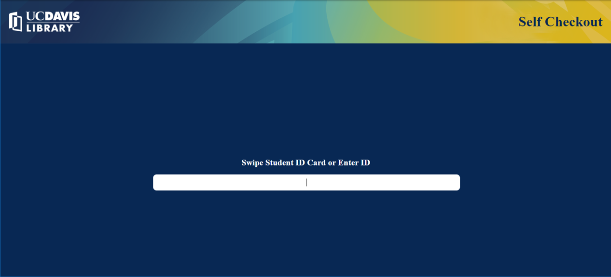
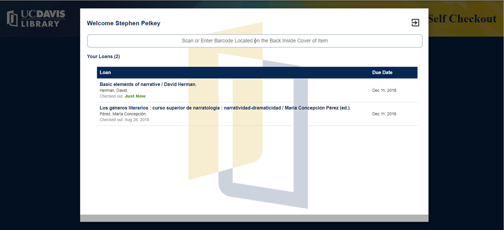

# Self Checkout
Polymer 3 application for self checkout using Alma. It is under development.



## Setup

For development, you can enter an Alma key, which will make calls directly to the Alma API. When put into production, you will need to set up a proxy server (functionality coming soon)
```html
    <library-self-checkout library="AlmaLibrary"
                           circdesk="AlmaCircdesk"
                           alma_key = 'AlmaUserapikey'>
    </library-self-checkout>
```

Use the `logout_time` property to set the duration (ms) of inactivity at which point a user will be logged out.
